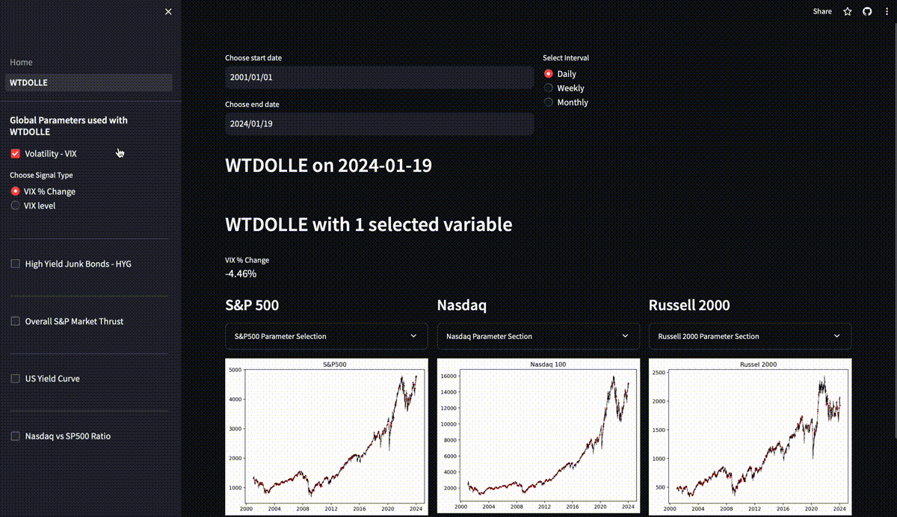

# What Transpired During Our Last Encounter (WTDOLLE) - visit website: https://wqureshi.streamlit.app/

 This is a project to assess what happened to the stock market in an X number of days given when certain indicators or market conditions existed. Examples of such indicators are:
 - Nasdaq vs SP500 Ratio or Russell 2000 vs SP500 Ratio
 - 2 Year Treasury Yield vs 10 year or 30 Year Yield Difference
 - RSI of indices
 - VIX (volatility index) level or % changes
 - High Yield Junk Bond (HYG Ticker) levels or % Change
 - More to come

 The aspiration is that this project is able to build graphical and numerical indicators on when to buy or sell stocks based on information inputted.

